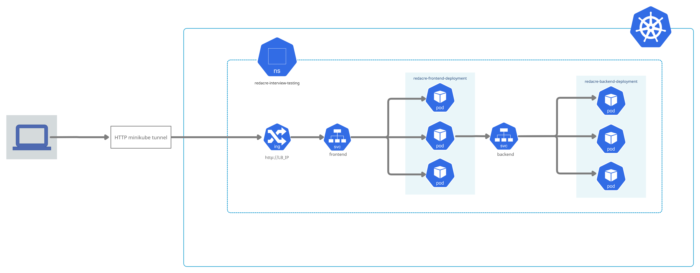

# Redacre Devops tasks
## Task_1
### Overview
Backend and Frontend implimentation: 
- Docker files make use of multi-stage builds to minimize image size.
- Both are based on Alpine images.
- Containers run as a non-root user for security purposes.
- Frontend App.js file was modified to call *backend:5000/stats* instead of *localhost:5000/stats*.
    - This was done to use a bridged docker network for inter-container communication using dns resolutions.
    - Utilised in [task_3](./task_3) to allow API calls to be made to the service instead of the pods directly. 
    
HAProxy
- Environment variable added in [haproxy.cfg](./task_1/haproxy/haproxy.cfg). This simplifies setting of reverse-proxy server depending on the frontend's container's hostname.

For usage notes see [task_1](./task_1).

## Task_2
### Overview

## Task_3
### Flow diagram

### Overview
This implimentation consists of the following:
- Deployments for the frontend and backend applications, both replicated with 3 pods each.
    - Resource limits were implimented per pod's container to avoid resource run-away in case of an unpredictable bug in code.
- ClusterIP services for each deployment to load-balance between the pods.
- Ingress resource to forward traffic recieved on port 80 to port 3000 of the frontend service
- All the above recide on the *redacre-interview-testing* namespace.

>**Note:** Docker images used are the same from **task_1**.

For usage notes see [task_3](./task_3).
